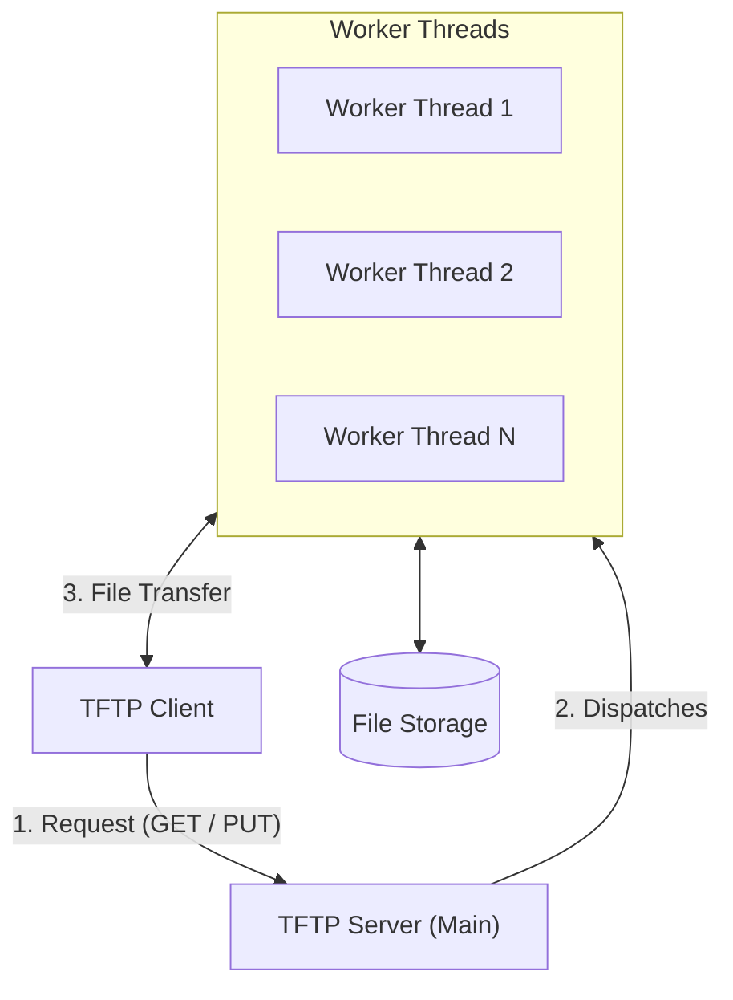

# Multithreaded TFTP Server & Client

A multithreaded TFTP (Trivial File Transfer Protocol) implementation in C using UDP/IP sockets, POSIX threads (`pthreads`), and counting semaphores (`sem_t`) for concurrency control.

---

## 🏗️ Architecture & Block Diagram

The server uses a **Master Dispatcher + Worker Thread** model. The main server thread listens on the well-known port (`8080`), while dedicated worker threads handle file transfers over ephemeral UDP sockets. Concurrent workers are constrained to a maximum of **10 active threads** using a POSIX counting semaphore.

### System Block Diagram



### ASCII Block Diagram

```text
+-------------+          1. Request (GET / PUT)          +--------------------+
|             | ---------------------------------------> |                    |
| TFTP Client |                                          | TFTP Server (Main) |
|             | <======================================+ +--------------------+
+-------------+       3. File Data Transfer            |           |
                                                       |           | 2. Dispatches
                                                       v           v
                                                +------------------------+
                                                |     Worker Threads     |
                                                | (Thread 1, Thread 2..) |
                                                +------------------------+
                                                           |
                                                           | Reads / Writes
                                                           v
                                                +------------------------+
                                                |      File Storage      |
                                                +------------------------+
```

---

## ⚡ Concurrency & Resource Management

1. **Thread Limiting via Counting Semaphore**:
   - Initialized at startup: `sem_init(&thread_sem, 0, 10)`.
   - Before spawning a transfer thread, `sem_trywait(&thread_sem)` checks permit availability non-blockingly.
   - If 10 transfers are already active, the server immediately sends an `ack_packet` with `ack = 0` (`"Server is busy"`) without blocking the main listener loop.
2. **Detached Worker Lifecycle (No Resource Leaks)**:
   - Threads are created with `PTHREAD_CREATE_DETACHED` (`pthread_attr_setdetachstate`).
   - The OS automatically reclaims thread stacks and internal descriptors upon thread termination without requiring `pthread_join()`.
   - On completion, worker threads close their private UDP socket, free their heap-allocated `FileContext`, and invoke `sem_post(&thread_sem)`.
3. **Port Isolation / TID Multiplexing**:
   - Each transfer worker opens its own ephemeral UDP socket (`socket(AF_INET, SOCK_DGRAM, 0)`).
   - This prevents race conditions and packet collisions where multiple clients simultaneously send `DATA` or `ACK` packets to the master socket.

---

## 📁 Directory Structure

```text
.
├── Makefile                # Build system (supports all, client, server, clean, debug)
├── README.md               # Project documentation
├── client_downloads/       # Client-side download destination directory
├── server_downloads/       # Server storage directory for hosted files
└── src/
    ├── commons/            # Shared protocols, definitions, and utilities
    │   ├── commons.c       # Block transfer loops and filename parsers
    │   ├── commons.h       # Packet structures, opcodes, and transfer modes
    │   └── logs.h          # Diagnostic and error logging macros
    ├── client/             # TFTP Client implementation
    │   ├── client_utils.c  # Client network logic (connect, get, put, mode)
    │   ├── client_utils.h  # Client header declarations
    │   └── main.c          # Client CLI interactive prompt loop
    └── server/             # TFTP Server implementation
        ├── server_utils.c  # Handlers for CONNECT, GET, PUT, MODE, QUIT
        ├── server_utils.h  # Server function signatures
        └── main.c          # Main listener loop and worker dispatch
```

---

## 📦 Packet Protocol

Packets are exchanged over UDP with custom headers:

### 1. Command Packet (`cmd_packet`)
Sent by the client to initiate operations:
```c
typedef struct {
    int opcode;                // CONNECT, GET, PUT, QUIT, MODE
    char data[DATA_BLOCKSIZE]; // Arguments (e.g. filename(s), transfer mode string)
} cmd_packet;
```

### 2. Acknowledgment Packet (`ack_packet`)
Sent in response to commands and data blocks:
```c
typedef struct {
    int opcode;        // ACK
    int block_num;     // Sequence number of acknowledged block
    int ack_op;        // Opcode being acknowledged (CONNECT, GET, PUT, etc.)
    char ack;          // 1 = Success / ACK, 0 = Failure / NACK / Busy
    char message[128]; // Filename, rejection notice, or status text
} ack_packet;
```

### 3. Data Packet (`data_packet`)
Used during file transmission:
```c
typedef struct {
    char opcode;               // DATA
    int block_num;             // Block sequence number (1, 2, 3...)
    int data_len;              // Payload length in bytes
    char data[DATA_BLOCKSIZE]; // File payload (up to 512 bytes)
} data_packet;
```

---

## 🔄 Transfer Modes

The server and client support 3 transfer modes:

| Mode | Identifier | Description |
| :--- | :--- | :--- |
| **Octet** (Default) | `MODE_OCTET` | Standard binary transfer in 512-byte blocks. |
| **Byte** | `MODE_BYTE` | Single-byte transfer (1 byte payload per block). |
| **Mail** | `MODE_MAIL` | Text mode converting line endings (`\n` $\leftrightarrow$ `\n\r`). |

---

## 🚀 Building & Running

### Prerequisites
- GCC / Clang
- POSIX-compliant operating system (Linux / macOS)
- `make`

### Compilation
Build both server and client:
```bash
make all
```

Or build individually:
```bash
make server   # Builds build/bin/tftp_server
make client   # Builds build/bin/tftp_client
```

Clean build artifacts:
```bash
make clean
```

### 1. Start the Server
Run the server executable from the project root:
```bash
./build/bin/tftp_server
```
*The server will bind to `127.0.0.1:8080` and listen for incoming client commands.*

### 2. Start the Client
Open a separate terminal window and launch the client:
```bash
./build/bin/tftp_client
```

---

## 💻 Client CLI Commands

Once inside the interactive `tftp>` shell:

| Command | Description | Example |
| :--- | :--- | :--- |
| `connect <ip>` | Connect to server address | `connect 127.0.0.1` |
| `get <file1> [file2 ...]` | Download file(s) to `client_downloads/` | `get test.txt` |
| `put <file1> [file2 ...]` | Upload file(s) from current directory | `put test.txt` |
| `mode <octet\|byte\|mail>` | Switch transfer mode | `mode octet` |
| `help` | Display command help menu | `help` |
| `quit` | Disconnect and exit client | `quit` |
